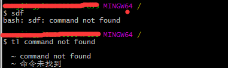
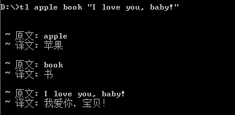
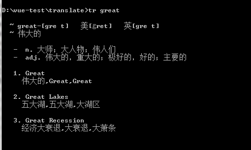
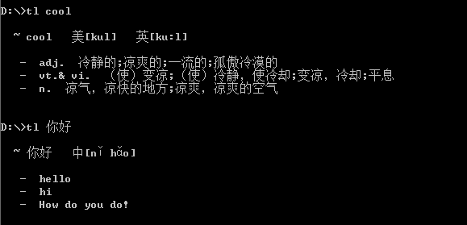

# terminal-translate
[](https://github.com/ShanaMaid/terminal-translate) 
[](https://github.com/ShanaMaid/terminal-translate)
[](https://www.npmjs.com/package/terminal-translate)

[](https://nodei.co/npm/terminal-translate/)

命令行翻译工具，三大翻译引擎支持!

命令行英文报错怎么办？复制报错内容, `tl`一下即可！



## 一些注意事项
百度翻译引擎限制: 200W字符/月

有道翻译引擎限制: 1000次请求/时，申请了四个`key`，4000次请求/时

爱词霸翻译引擎限制: 无限制

当百度翻译引擎和有道翻译引擎的资源耗尽报错时，请使用`tl -e iciba`切换爱词霸翻译引擎！

如果使用量大，请自行申请API并更换配置文件中的`key`！


## 翻译引擎支持

- [x] 百度翻译 - 支持多单词、多句子、单词句子混合翻译， 语言翻译方向最多, `tl -l`查看支持翻译语言
- [x] 有道翻译 - 只支持单句子或单词互译， 
- [x] 爱词霸翻译 - 只支持单词或者短语翻译


工具默认使用`有道翻译`！

...持续添加中

## 安装
```
npm install terminal-translate -g
```

## 帮助
指令`tl` 或者 `translate`

`tl -h` 查看帮助菜单
```
  Usage: translate
  a tearmail-transtalte tool!
  GithubID: ShanaMaid
  Repository: https://github.com/ShanaMaid/terminal-translate.git

  Options:

    -h, --help               output usage information
    -v, --version            show version
    -f, --baidu-from <from>  baidu engine: from language, default: auto
    -t, --baidu-to <to>      baidu engine: to language, default: zh
    -l, --baidu-language     baidu engine language
    -e, --engine <to>        change translate engine
    -c, --config             show config.json

```


## 使用手册
### 百度翻译引擎

百度翻译引擎默认翻译结果为中文

单纯需要了解单词或句子意思建议使用百度翻译，同时百度翻译支持多单词、多句子、单词句子混合翻译！

切换翻译引擎为百度翻译输入以下指令
```
tl -e baidu
```

修改百度翻译引擎语言翻译结果为英语，翻译结果不能修改`auto`
```
tl -t en
```

修改百度翻译引擎语言翻译起始语言为中文(不建议修改，默认值为auto，会自动检测)
```
tl -f zh
```

查看百度翻译引擎支持的语言翻译列表
```
tl -l
```

单个单词翻译
```
tl word
```

多个单词以空格分隔
```
tl apple book
```

句子翻译请以双引号包裹
```
tl "I love you, baby!"

```

单词句子混合同时翻译
```
tl apple book "I love you, baby!"
```

混合翻译



### 有道翻译引擎

有道翻译引擎适合用于学习了解单词意思，只支持单个单词或句子翻译，多个单词翻译会把单词集合判断为句子，句子翻译时无须像百度引擎一样用双引号包裹！

任何输入任何非中文的语言均会被翻译成中文，如果中文输入则会被翻译成英文

切换翻译引擎为有道翻译输入以下指令
```
tl -e youdao
```

单个单词翻译结果



句子翻译结果


中文句子翻译结果


### 爱词霸翻译引擎

切换爱词霸翻译引擎
```
tl -e iciba
```

爱词霸翻译引擎属于词典翻译，支持单个单词或者单词短语翻译，句子翻译时会报错!
```
  iciba can't translate sentences! 
  please use youdao or baidu!
```




## 版本更新记录

v1.0.4 翻译结果支持彩色显示，更加显眼瞩目

v1.0.3 支持爱词霸翻译引擎，新增3个有道翻译`key`

v1.0.2 支持有道翻译引擎，修复一些BUG

v1.0.1 支持百度翻译引擎

v1.0.0 发布


## 支持
如果工具有任何BUG或者你想提出改进建议，请提`issue`!

如果你对此工具非常满意不妨`star`或者打赏我请我喝一瓶`脉动`？


## 声明
单词翻译结果样式参照了[@偏右](https://github.com/afc163)的[fanyi](https://github.com/afc163/fanyi)


